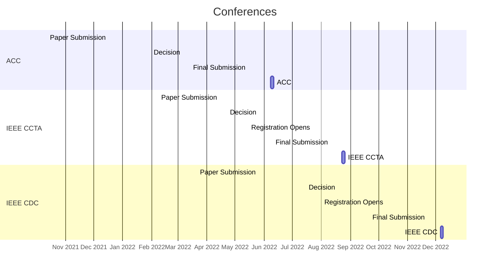

---
# An instance of the Pages widget.
# Documentation: https://wowchemy.com/docs/page-builder/
widget: pages

# This file represents a page section.
headless: true

# Order that this section appears on the page.
weight: 100

title: Recent Posts
subtitle:

content:
  # Page type to display. E.g. post, talk, publication...
  page_type: post
  # Choose how many pages you would like to display (0 = all pages)
  count: 5
  # Filter on criteria
  filters:
    author: ""
    category: ""
    tag: ""
    exclude_featured: false
    exclude_future: false
    exclude_past: false
    publication_type: ""
  # Choose how many pages you would like to offset by
  offset: 0
  # Page order: descending (desc) or ascending (asc) date.
  order: desc

design:
  # Choose a view for the listings:
  #   1 = List
  #   2 = Compact
  #   3 = Card
  #   4 = Citation (publication only)
  view: 2
---
# Conference Schedule

