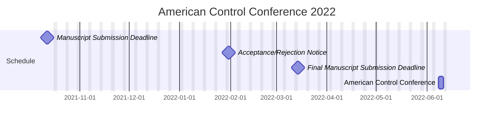

The 2022 [American Control Conference](https://acc2022.a2c2.org/) schedule is as follows:
- Manuscript Submission Deadline (2021-10-12)
- Acceptance/Rejection Notice (2022-01-31)
- Final Manuscript Submission Deadline (2022-03-14)
- American Control Conference (2022-06-08)

This year I have been collaborating with other researchers and plan to present four papers:

- [Competitive Perimeter Defense of Conical Environments
](/publication/bajaj2022competitive)
- [Optimal Strategies for the Game of Protecting a Plane in 3-D
](/publication/garcia2022optimal)
- [Power Management for Noise Aware Path Planning of Hybrid UAVs](/publication/scott2022power)
- [On Improving the Potential Field Method for Ring Formation
](/publication/tran2022improving)
