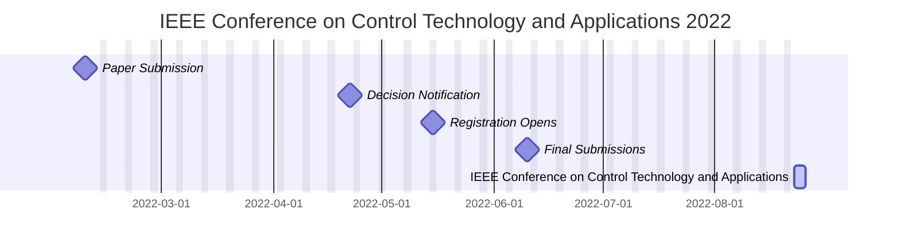

The 6th IEEE [Conference on Control Technology and Applications](https://ccta2022.ieeecss.org/) will be held Tuesday through Thursday, August 23 – 25, at Stazione Marittima, Trieste, Italy. 

The 2022 [Conference on Control Technology and Applications](https://ccta2022.ieeecss.org/) schedule is as follows:
- Paper Submission (2022-02-08)
- Decision Notification (2022-04-22)
- Registration Opens (2022-05-15)
- Final Submissions (2022-06-10)
- IEEE Conference on Control Technology and Applications (2022-08-23)

