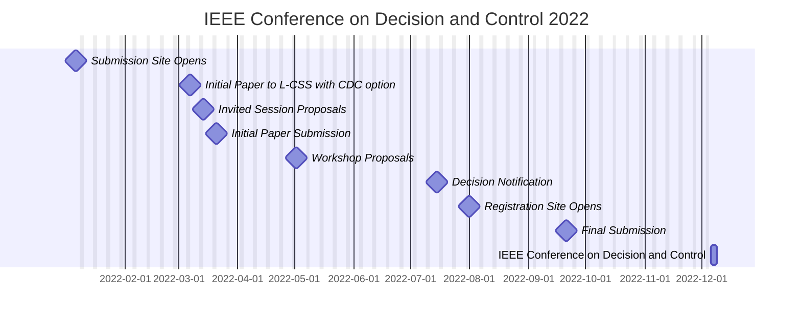

The 2022 [Conference on Decision and Control](https://cdc2022.ieeecss.org/) schedule is as follows:
- Submission Site Opens (2022-01-06)
- Initial Paper to L-CSS with CDC option (2022-03-07)
- Invited Session Proposals (2022-03-14)
- Initial Paper Submission (2022-03-21)
- Workshop Proposals (2022-05-02)
- Decision Notification (2022-07-Mid)
- Registration Site Opens (2022-08-01)
- Final Submission (2022-09-21) 